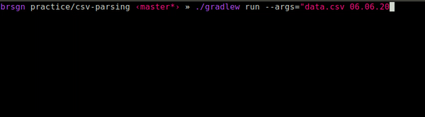

## Количество дорожных ограничений

Задачу взял [отсюда](https://habr.com/ru/post/440436/#final_exercises). 

### Задача:

С портала открытых данных Санкт-Петербурга загружаются [данные об ограничении движения транспорта на период производства работ](https://data.gov.spb.ru/opendata/7803032323-block_traffic/) в формате csv.

Требуется определить, сколько дорожных ограничений действовало в городе на определенную дату.

Программа в качестве аргумент получает два параметра:
- Путь к файлу с данными
- Дата

запускается следующим образом:

```
java TrafficBlocks "PATH_TO_CSV_FILE" dd.MM.yyyy
```

Необходимо вывести количество действовавших ограничений движения транспорта на эту дату.

### Что сделал

