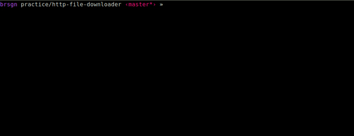

## Консольная утилита для скачивания файлов по HTTP

Задачу взял [отсюда](https://habr.com/ru/post/440436/#final_exercises). 

### Задача:

Написать программу, которая считывает список ссылок в текстовом файле, скачивает эти файлы и сохраняет в указанную папку на локальном диске. Утилита должна уметь качать несколько файлов одновременно (в несколько потоков, например, 3 потока) и выдерживать указанное ограничение на скорость загрузки, например, 500 килобайт в секунду.

### Че сделал

