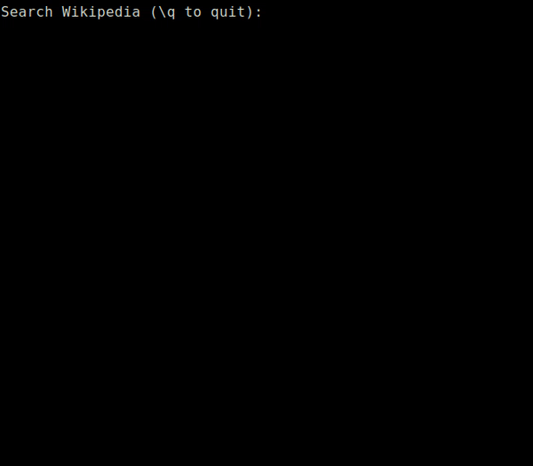

## Поиск по Википедии в консольной программе

Задачу взял [отсюда](https://habr.com/ru/post/440436/#final_exercises). 

### Задача:

Напишите программу, которая с консоли считывает поисковый запрос, и выводит результат поиска по Википедии. 

### Че сделал

